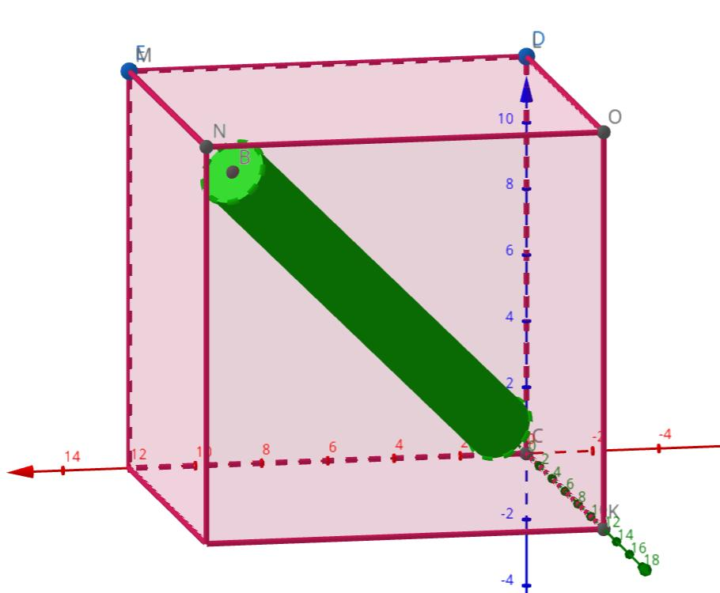
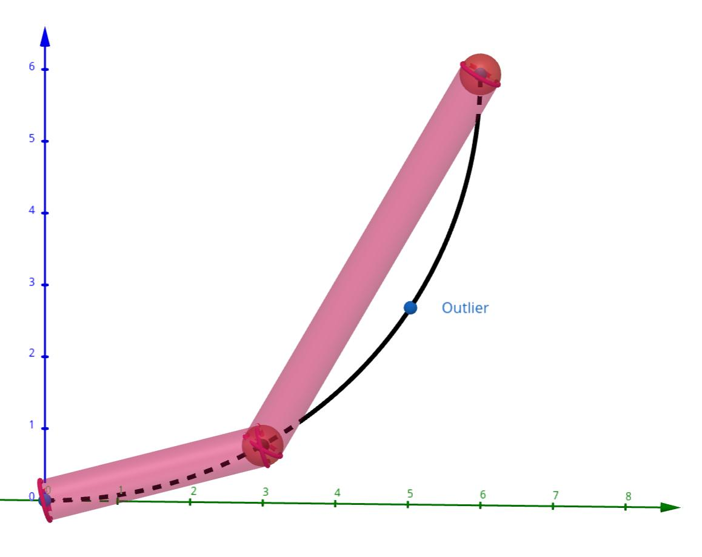

# Sphere move project

## Task description

A 3d Euclidian point cloud aligned in main axis directions (x, y, z) and with a constant distance grid
(Figure 1) starting at a given reference point (the point with indices 0, 0, 0 is located at reference
point) is intersected by a move of sphere (Figure 2), where the path of the sphere center is defined
by a user given formula ~x = f (t) where t is in the interval between t0 and t1 . The function f (t) can
be handled as a discrete function with a user given ∆t.

- Only the first layer of points (which remains visible/undeleted) from top view must be written
to a file as ASCII data (the skin of the point cloud visible from positive Z direction, see Figure 3
right). The file format is defined as follows:
  - Each line contains a single point.
  - The point definition contains x, y and z coordinates delimited by space characters.
  - Each line ends with a new line character. 
- Create a small documentation(1 page with 2 pictures) to present the mathematical approach of
the sphere move point intersection. It should clearly communicate the mathematical approach
and how the mathematical code is generated from that. 
- Please discuss briefly in 4-5 sentences what problems can arise by using a discrete stepping ∆t

## Data structure

All points of given object are located in uniform grid with some fixed step.
Parameters of a particular grid are described in [GridParameters3d](./include/GridParameters3d.hpp) class

This allows to store all points as nested arrays of boolean field which says 
if given point belongs to this object or not.

To manipulate all points [PointCloud](./include/PointCloud.hpp) class is used.

To convert between actual points and indices of grid special member functions are used
`GridParameters3d::PointToIndex` and `GridParameters3d::IndexToPoint`.

## Algorithm description

Task trajectory is defined as discrete function with some step.
Let's assume, that in between points in time, sphere movement approaches linear movement.

All points on the way of sphere is located inside **capsule** 
(which is modelled as cylinder and two spheres)
with start and end points located at previous and current point of discrete curve.

An example of such sphere movement model is below.

Dashed line represents actual function, sampled with discrete fixed step of x 

### Volume

[Volume](./include/Volume.hpp) is a virtual object, which can be used with PointCloud instance to find intersections at grid nodes.

It contains the member function `Volume::GetInternalPoints` 
It must return all points inside an object lying on global grid.
Function is implemented and optimized of each object separately.

### SphereLinearMotion

[Next step motion](include/SphereLinearMotion.hpp) is constructed from initial sphere and destination point, 
which is used to get all necessary parameters.

Object combines a cylinder  - to exclude all points met by sphere during movement
and a sphere at final position.

### Sphere

A [sphere](include/Sphere.hpp) with fixed radius represents a tool, that is moving in space with given trajectory.
To get all points we filter all points inside a cube with sphere diameter as it's side.

### Cylinder

A [cylinder](include/Cylinder.hpp) is handled the same as sphere, and for a cylinder with small length to radius ratio it is fine.
When cylinder length goes to 0, bounding box will be the same as for sphere. 

but there can be a performance degradation if this ratio is too big, 
because in this case there are mostly empty space contained in bounding box

For this task we can take sufficiently small step to avoid this issue.

## Possible problems

### Discrete step inaccuracies

If too big constant discrete step is used there could be some points, 
that will not be removed from point cloud when they should be. 
For example, here is such situation.

# Task solution

After running program and visualizing it, following results produced

